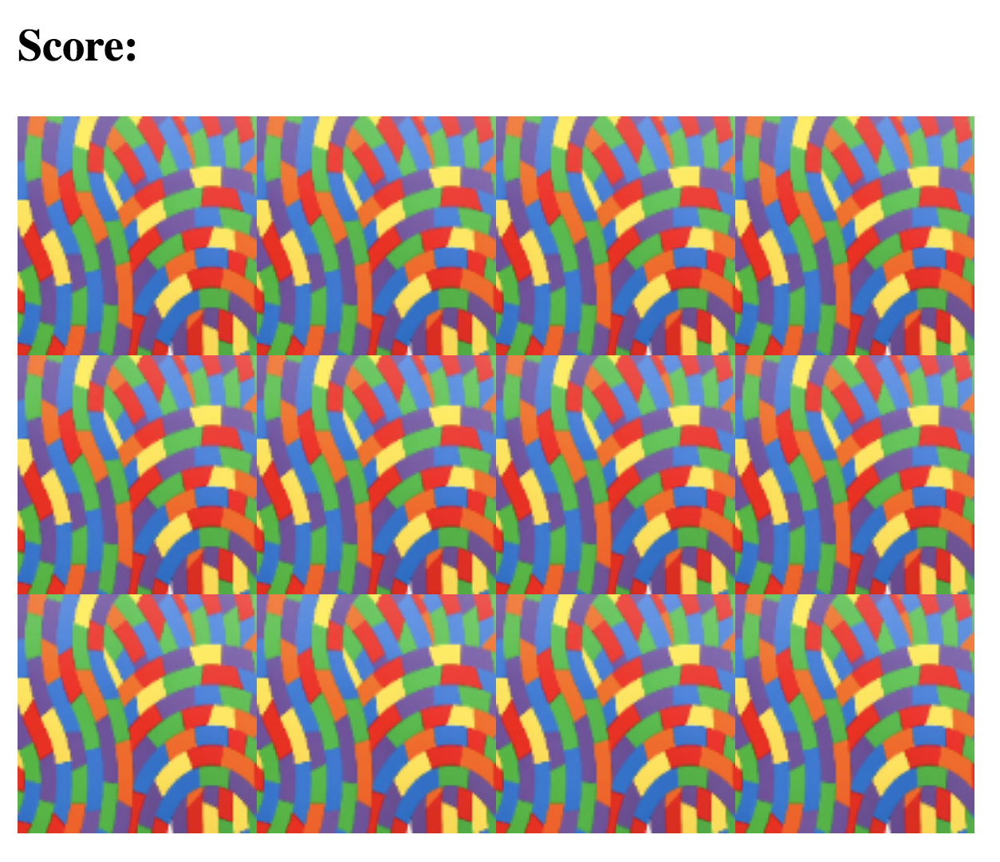
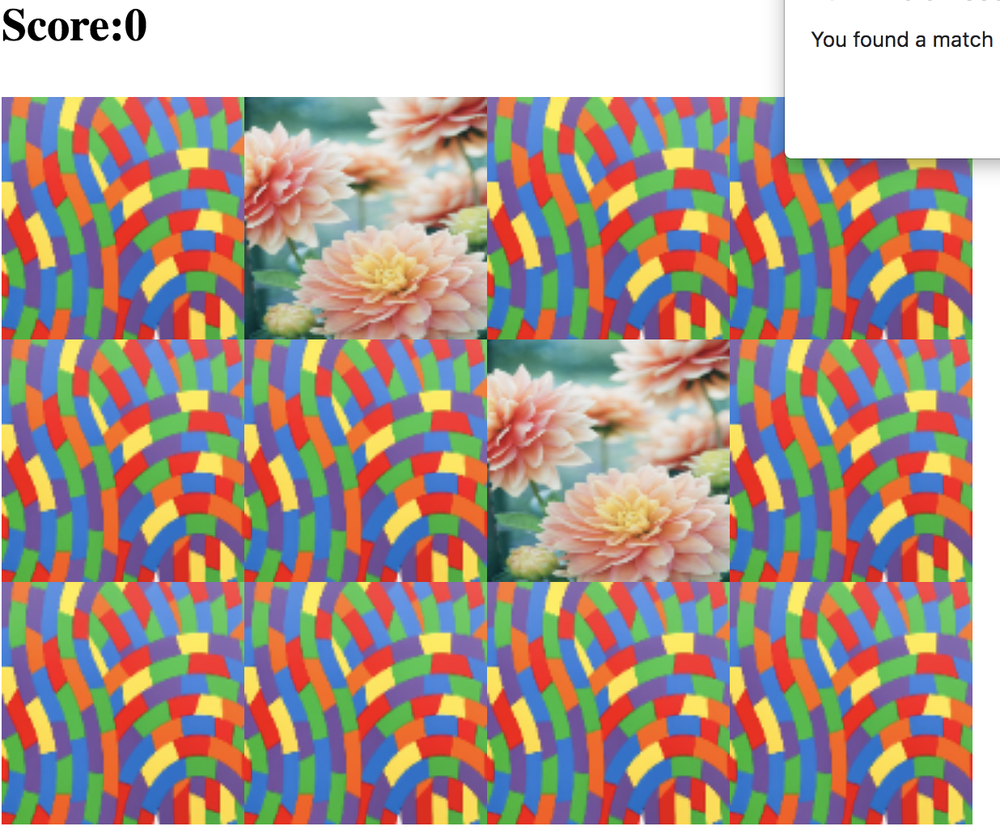
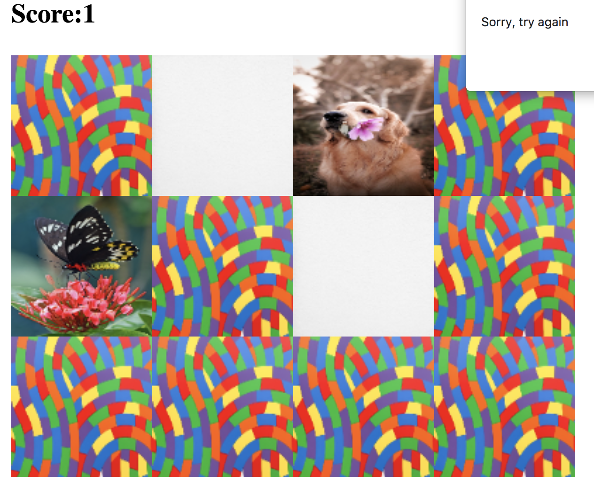
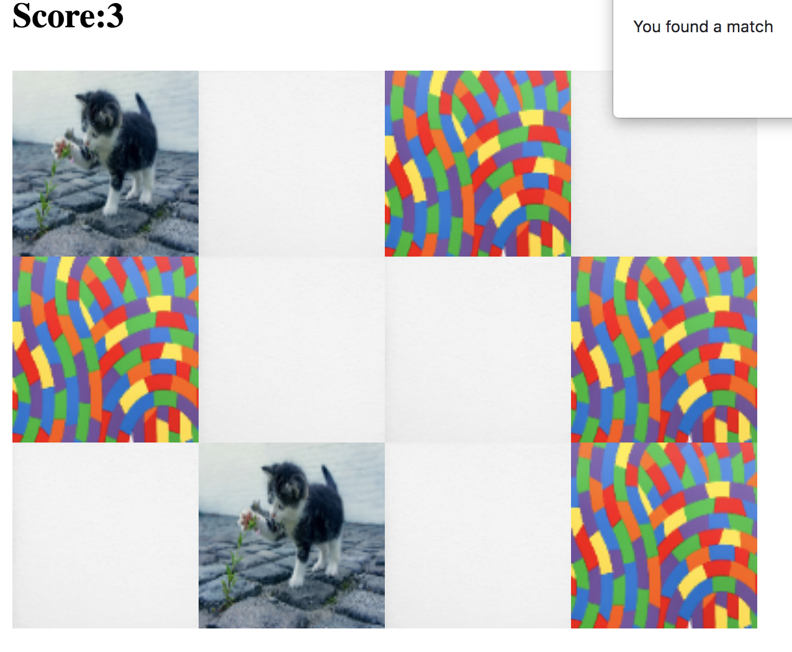
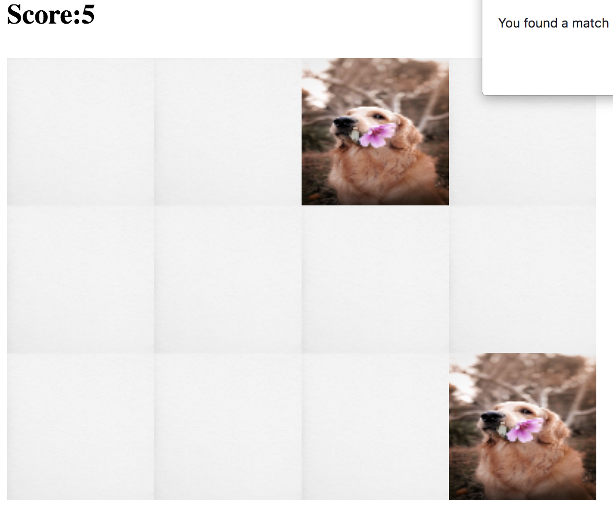
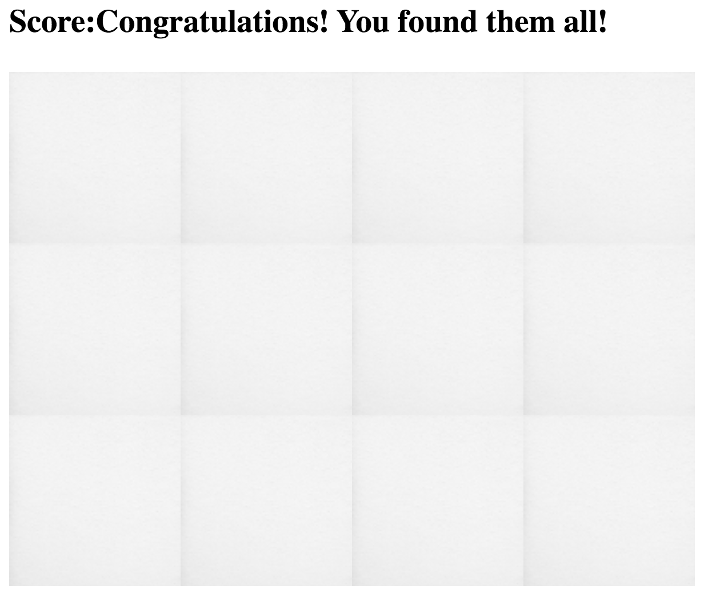

<h1>Memory Game</h1>

Welcome to the Memory Game project! 
  This is a classic concentration game 
  where you can test your memory skills by 
  flipping over two cards at a time, aiming to find matching pairs.

  
You have won, as soon as you flip over all the cards and they are matched.

  <h2>Technologies Used</h2>

  <ul>
    <li>HTML</li>
    <li>CSS</li>
    <li>JavaScript</li>
  </ul>

  Here are screenshots of the game:

  
   
  
   
  
   
  
   
  
   
  
